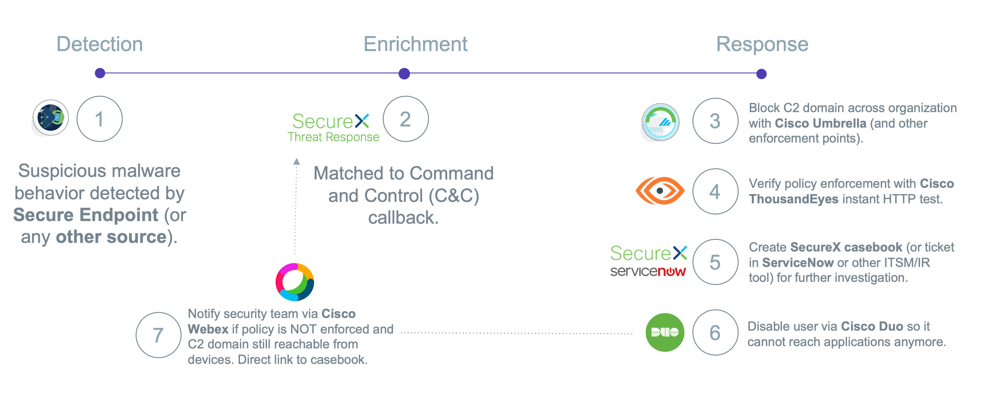

# Automated SecOps workflow with Policy Enforcement Verification
This workflow will serve as an example of a SecOps workflow that includes automation remediation via Cisco Umbrella (block C2 domain), Cisco ThousandEyes (policy enforcement verification) Cisco Duo (disable user), Cisco SecureX (create casebook) and Cisco Webex (send notifcation). One could easily add/replace other solutions as well. 

> **Note:** Please test this properly before implementing in a production environment. This is a sample workflow!

## Required Targets and API Keys
- [SecureX Threat Response API](https://visibility.amp.cisco.com/help/integration)
- [ThousandEyes API v6](https://developer.thousandeyes.com/v6/)
- [Umbrella Management API](https://developer.cisco.com/docs/cloud-security/#!destination-lists-introduction-overview)
- [Duo Admin API](https://duo.com/docs/adminapi)
- [Webex Teams](https://developer.webex.com/docs/getting-started)

## Setup instructions

1. Browse to your SecureX orchestration instance. This wille be a different URL depending on the region your account is in: 

* US: https://securex-ao.us.security.cisco.com/orch-ui/workflows/
* EU: https://securex-ao.eu.security.cisco.com/orch-ui/workflows/
* APJC: https://securex-ao.apjc.security.cisco.com/orch-ui/workflows/

### Import atomic actions

1. In the left pane menu, select **Workflows**. Click on **IMPORT** to import the workflow:

2. Click on **Browse** and copy paste the content of the [sxo_secops_workflow.json](https://raw.githubusercontent.com/github-username/name-of-repo/main/sxo_secops_workflow.json) file inside of the text window. Select **IMPORT AS A NEW WORKFLOW (CLONE)** and click on **IMPORT**.

### Import main workflow

1. In the left pane menu, select **Workflows**. Click on **IMPORT** to import the workflow.

2. Click on **Browse** and copy paste the content of the [sxo_secops_workflow.json](https://raw.githubusercontent.com/github-username/name-of-repo/main/sxo_secops_workflow.json) file inside of the text window.  Select **IMPORT AS A NEW WORKFLOW (CLONE)** and click on **IMPORT**.

3. Next you will need to update targets / account keys and setting a trigger to run the workflow.

## Notes

* Please test this properly before implementing in a production environment. This is a sample workflow!

## Author(s)

* Christopher van der Made (Cisco)
