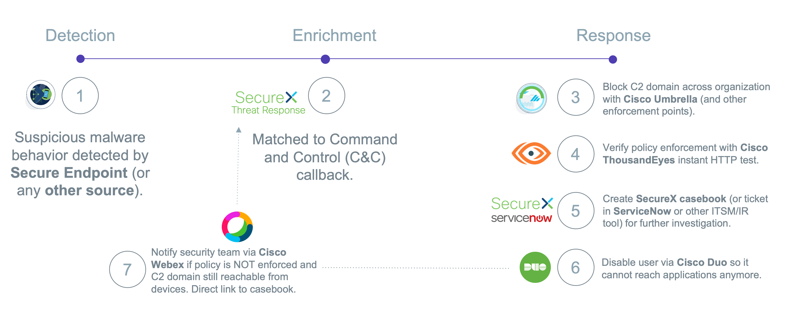

# SecureX orchestration workflow repository

* SecureX orchestration provides a no-to-low code approach for building automated workflows. 
* These workflows can interact with various types of resources and systems, whether they’re from Cisco or a third-party. 
* This repository contains atomic actions and workflows that can be imported into SecureX orchestration as well as a variety of documentation.
* This workflow will serve as an example of a SecOps workflow that includes automation remediation via Cisco Umbrella (block C2 domain), Cisco ThousandEyes (policy enforcement verification) Cisco Duo (disable user), Cisco SecureX (create casebook) and Cisco Webex (send notifcation). One could easily add/replace other solutions as well. 

## Business Case

Service-oriented orchestration provides the agility to model and act on IT services. These features make creating orchestration active and dynamic, and allow for:

* Defining new, higher-level services in the system, and deploy new services quickly.
* In real-time, after these new types of services have been defined, creating real-time instances of those new services.
* Using events to watch for patterns in these services, enabling policy-driven automation.
* Service-oriented Orchestration combines several industry trends to synthesize a fresh approach to orchestration:

Please continue your reading in this [white paper](https://www.cisco.com/c/en/us/products/collateral/security/white-paper-c11-744498.html).

## Related Sandbox
Currently there is no DevNet sandbox yet, however you can find all options to try out SecureX orchestration [here](https://developer.cisco.com/learning/lab/Cisco-SecureX-101-lab/step/1)!

## List of SecureX Learning Labs
* Please try out [this SecureX DevNet learning lab](https://developer.cisco.com/learning/modules/SecureX-orchestration) to try this yourself. 
* Please also check out the [SecureX microsite](https://developer.cisco.com/securex/) on DevNet!

## Solutions on Ecosystem Exchange
Please check out related solutions on [DevNet Ecosystem Exchange](https://developer.cisco.com/ecosystem/solutions/#key=securex).
